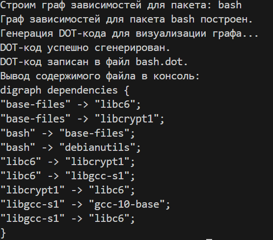
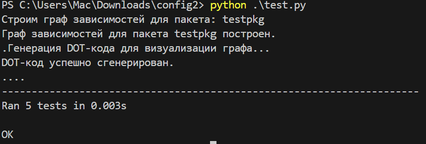

Задание №2
Разработать инструмент командной строки для визуализации графа
зависимостей, включая транзитивные зависимости. Сторонние средства для
получения зависимостей использовать нельзя.
Зависимости определяются по имени пакета ОС Ubuntu (apt). Для описания
графа зависимостей используется представление Graphviz. Визуализатор должен
выводить результат на экран в виде кода.
84
Ключами командной строки задаются:
• Путь к программе для визуализации графов.
• Имя анализируемого пакета.
• Путь к файлу-результату в виде кода.
• URL-адрес репозитория.
Все функции визуализатора зависимостей должны быть покрыты тестами.
запуск:  python main.py --graphviz-path "C:\Program Files\Graphviz\bin\dot.exe" --package-name bash --output-file bash.dot --repo-url http://archive.ubuntu.com/ubuntu/dists/focal/main/binary-amd64/Packages.gz

тесты: